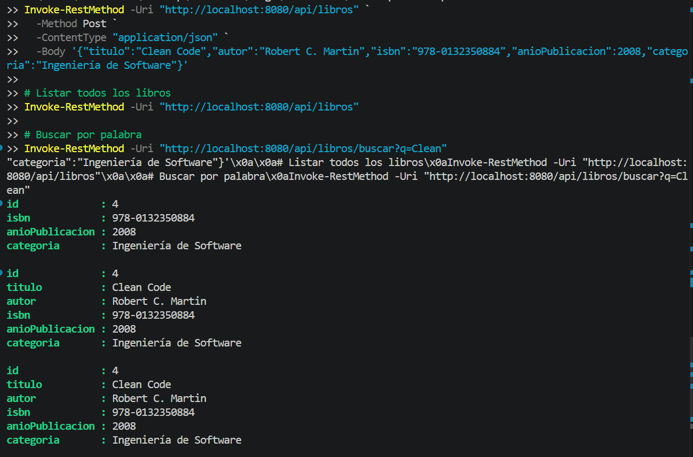

# U5 Post-Contenido 1 - CRUD con Spring Boot + Repository

## Objetivo
Implementar una API REST de biblioteca usando capas Entity, Repository, Service y Controller con H2 embebida.

## Tecnologias
- Java 17
- Spring Boot 3.2.x
- Spring Web
- Spring Data JPA
- H2 Database
- Validation
- Lombok

## Ejecutar
```bash
mvn clean spring-boot:run
```

## Endpoints
- `POST /api/libros`
- `GET /api/libros`
- `GET /api/libros/{id}`
- `PUT /api/libros/{id}`
- `DELETE /api/libros/{id}`
- `GET /api/libros/buscar?q=texto`

## Verificacion
- Consola H2: `http://localhost:8080/h2-console`
- API base: `http://localhost:8080/api/libros`



## Evidencias de Verificacion (2026-04-17 16:26:56)

| Checkpoint | Estado | Evidencia |
|---|---|---|
| Compila sin errores (mvn compile) | PASS | mvn -q -DskipTests compile |
| Aplicacion inicia en puerto de prueba | PASS | http://localhost:18501 |
| GET /api/libros inicial retorna 200 | PASS | status=200 |
| POST /api/libros retorna 201 con recurso creado | PASS | status=201, id=1 |
| GET /api/libros/buscar retorna resultado esperado | PASS | status=200 |
| DELETE /api/libros/{id} existente retorna 204 | PASS | status=204 |
| DELETE /api/libros/{id} inexistente retorna 404 | PASS | status=404 |


